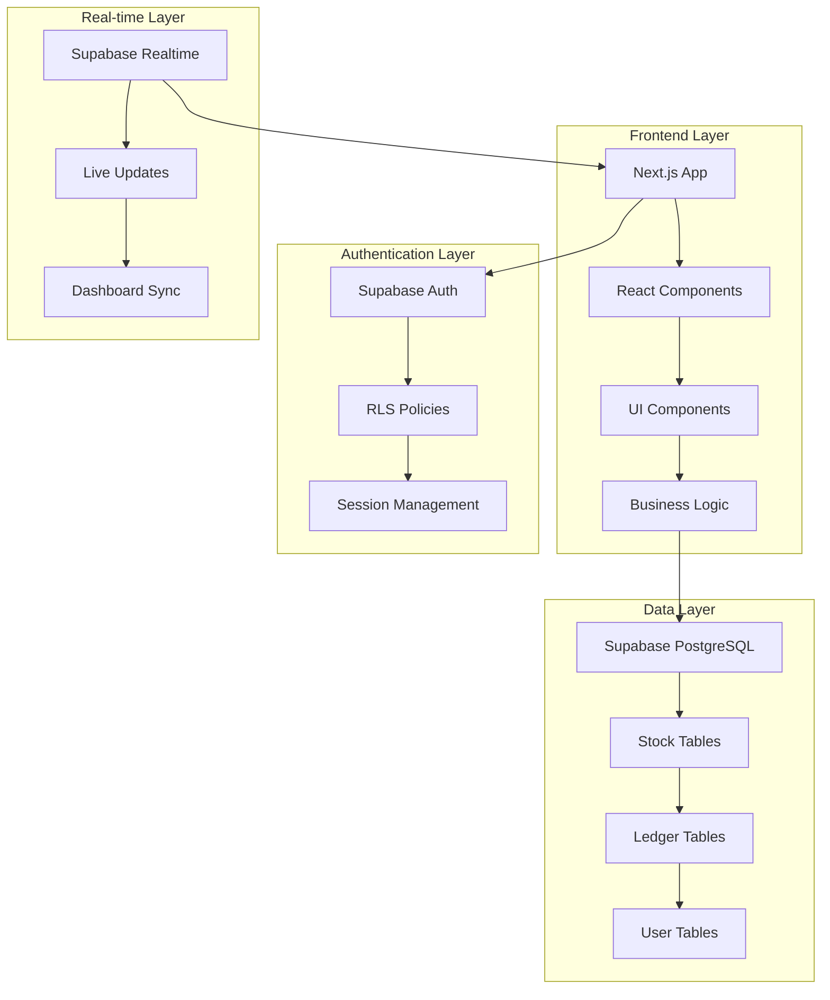

# 🏢 StockMaster

<div align="center">

**Enterprise-Grade Multi-Warehouse Inventory Management System**

[](https://nextjs.org/)
[](https://reactjs.org/)
[](https://supabase.com/)
[](https://tailwindcss.com/)
[](https://www.typescriptlang.org/)
[](https://vitest.dev/)

[](https://choosealicense.com/licenses/mit/)
[](https://stock-master-phi.vercel.app/)

*A modern, role-aware inventory control tower that digitizes warehouse operations with real-time visibility and secure access management.*

</div>

---

## � Table of Contents

- [� Overview](#-overview)
- [✨ Key Features](#-key-features)
- [🛠️ Tech Stack](#️-tech-stack)
- [🏗️ Architecture](#️-architecture)
- [📁 Project Structure](#-project-structure)
- [⚙️ Installation & Setup](#️-installation--setup)
- [🔐 Security Features](#-security-features)
- [📊 Real-time Capabilities](#-real-time-capabilities)
- [🚀 Deployment](#-deployment)
- [🧪 Testing](#-testing)
- [🗺️ Roadmap](#️-roadmap)
- [📝 License](#-license)

---

## 🚀 Overview

**StockMaster** is a comprehensive inventory management solution designed for multi-warehouse operations. Built with modern web technologies, it provides real-time stock tracking, role-based access control, and seamless workflow automation for inventory teams.

### 🎯 Business Problem Solved

- **Eliminates Spreadsheet Chaos**: Replace error-prone manual tracking with automated, validated workflows
- **Real-time Visibility**: Instant updates across all warehouse locations and team members
- **Role-based Security**: Granular access control ensuring critical operations require proper authorization
- **Audit Trail**: Complete transaction history with immutable ledger entries

### 🏆 Core Value Proposition

1. **🔄 Unified Operations** – Receipts, deliveries, transfers, adjustments, and ledger all share the same deterministic timestamp formatting and validation workflow
2. **⚡ Realtime Decisions** – Supabase Realtime pushes stock deltas into dashboards, product tables, and kanban boards without manual refreshes
3. **🔒 Secure Access** – Supabase Auth with login IDs + OTP reset flows, RLS policies, and UI-level guardrails keep critical actions under `inventory_manager` control

---

## ✨ Key Features

| 🏢 **Domain** | 🎯 **Highlights** | 🔧 **Technology** |
|---|---|---|
| **🔐 Authentication** | Login ID system, OTP-based password reset, signup redirect, session-aware sidebar with logout flyout | Supabase Auth, RLS Policies |
| **📊 Dashboard** | KPI grid (products, low stock, receipts, deliveries), deterministic timestamp formatting | React Query, Realtime Subscriptions |
| **📦 Receipts** | Search, list/kanban toggle, supplier contact card, editable drafts with assignee & scheduling | Form Validation, File Upload |
| **🚚 Deliveries** | Draft to validation workflow, pick/pack toggles, per-item status, manager-gated validation | Status Management, Role Gates |
| **🔄 Transfers** | Internal move logging, view toggle, validation, audit-friendly detail cards | Transaction System, Audit Trail |
| **⚖️ Adjustments** | Count variance tracking, ledger breakdown, color-coded differences, back navigation | Variance Analysis, History Tracking |
| **📖 Move History (Ledger)** | Search-as-you-type, icon-only view toggle, kanban columns by status, filterable data table | Advanced Filtering, Export Features |
| **⚙️ Settings** | Warehouses, locations, categories, products; CRUD restricted via RLS + UI gating | Admin Panel, Data Management |
| **👤 Profile** | Update full name, login ID, default warehouse; quick sign-out through sidebar | User Management, Preferences |

### 🎨 User Experience Features

- **📱 Mobile-Responsive Design**: Optimized for tablets and warehouse floor devices
- **🌙 Dark/Light Mode**: Automatic theme switching with system preferences
- **🔍 Advanced Search**: Real-time search across all inventory data
- **📈 Visual Analytics**: Interactive charts and KPI dashboards
- **🔔 Smart Notifications**: Contextual alerts for low stock and pending approvals

---

## 🛠️ Tech Stack

### 🎨 Frontend Technologies

<div align="center">

| 📦 **Technology** | 🎯 **Purpose** | 📖 **Version** |
|---|---|---|
| **⚛️ React** | UI Framework & Components | 18.2.0 |
| **🚀 Next.js** | Full-stack React Framework | 14.2.33 |
| **🎨 TailwindCSS** | Utility-First CSS Framework | 3.4.4 |
| **📝 TypeScript** | Type Safety & Better DX | 5.x |
| **🔥 Lucide React** | Beautiful Icon System | 0.344.0 |
| **⚡ Vitest** | Fast Unit Testing | 4.0.13 |

</div>

### 🗄️ Backend & Database

<div align="center">

| 📦 **Technology** | 🎯 **Purpose** | 📖 **Version** |
|---|---|---|
| **🐘 Supabase** | Backend-as-a-Service (PostgreSQL) | 2.39.0 |
| **🔐 Supabase Auth** | Authentication & User Management | Built-in |
| **⚡ Supabase Realtime** | Live Data Synchronization | Built-in |
| **🛡️ Row Level Security** | Database-level Access Control | Built-in |
| **🔧 PostgreSQL** | Primary Database Engine | 15+ |

</div>

### 🛠️ Development Tools

<div align="center">

| 📦 **Technology** | 🎯 **Purpose** | 📖 **Version** |
|---|---|---|
| **📦 npm** | Package Management | Latest |
| **🔧 ESLint** | Code Quality & Linting | 8.57.1 |
| **🎨 PostCSS** | CSS Processing | 8.4.38 |
| **🚀 Vercel** | Deployment Platform | Production |

</div>

---

## 🏗️ Architecture

### 🏛️ System Architecture Overview



### 🔐 Security Architecture

- **🛡️ Row Level Security (RLS)**: Database-level access control
- **🔑 JWT-based Authentication**: Secure session management
- **👥 Role-based Access Control**: `inventory_manager` vs `warehouse_staff`
- **🔒 API Security**: Service role keys for server operations
- **📝 Audit Logging**: Complete transaction history

### 📊 Data Flow Architecture

1. **User Actions** → React Components
2. **Form Validation** → Client-side Checks
3. **API Calls** → Supabase Client
4. **Database Operations** → PostgreSQL with RLS
5. **Real-time Updates** → Supabase Realtime
6. **UI Refresh** → Automatic Component Updates

---

## 📁 Project Structure

```bash
StockMaster/
├── 📂 app/                    # Next.js 14 App Router
│   ├── 📂 auth/               # Authentication flows (login, signup, OTP)
│   ├── 📂 (workspace)/        # Protected workspace area
│   │   ├── 📂 dashboard/      # Main dashboard with KPIs
│   │   ├── 📂 receipts/       # Receipt management
│   │   ├── 📂 deliveries/     # Delivery workflows
│   │   ├── 📂 transfers/      # Internal transfers
│   │   ├── 📂 adjustments/    # Stock adjustments
│   │   ├── 📂 ledger/         # Move history & audit
│   │   ├── 📂 settings/      # System configuration
│   │   └── 📂 profile/        # User profile management
│   ├── 📄 globals.css         # Global styles & Tailwind
│   ├── 📄 layout.jsx          # Root layout component
│   └── 📄 page.jsx            # Landing page
├── 📂 components/             # Reusable React components
│   ├── 📂 common/             # DataTable, StatusBadge, shared widgets
│   ├── 📂 layout/             # Sidebar, PageHeader, flyouts
│   ├── 📂 ui/                 # Base UI component library
│   ├── 📂 receipts/           # Receipt-specific components
│   ├── 📂 deliveries/        # Delivery workflow components
│   ├── 📂 transfers/         # Transfer management components
│   ├── 📂 adjustments/       # Adjustment tracking components
│   ├── 📂 move-history/       # Ledger & kanban components
│   ├── 📂 dashboard/         # Dashboard widgets
│   ├── 📂 settings/          # Settings forms
│   ├── 📂 profile/           # Profile components
│   ├── 📂 auth/              # Authentication forms
│   ├── 📂 forms/             # Form validation helpers
│   ├── 📂 loader/            # Loading states
│   ├── 📂 products/          # Product management
│   ├── 📂 reports/           # Reporting components
│   └── 📂 realtime/           # Real-time update handlers
├── 📂 lib/                    # Utility libraries
│   ├── 📂 supabase/          # Supabase client configurations
│   │   ├── 📄 client.js      # Browser client
│   │   ├── 📄 server.js      # Server-side client
│   │   ├── 📄 service-role.js # Admin operations
│   │   └── 📄 anon.js        # Public client
│   ├── 📄 auth.js            # Session utilities & guards
│   ├── 📄 formatters.js      # Date/time formatting helpers
│   ├── 📄 navigation.js      # Routing & navigation
│   ├── 📄 constants.js       # App constants & enums
│   ├── 📄 api-helpers.js     # API utility functions
│   ├── 📄 server-fetch.js    # Server-side fetching
│   ├── 📂 data/              # Static data & seeds
│   ├── 📄 env.client.js      # Client environment vars
│   └── 📄 env.server.js      # Server environment vars
├── 📂 supabase/              # Database schema & migrations
│   └── 📄 schema.sql         # Complete database definition
├── 📂 scripts/               # Utility scripts
│   └── 📄 seed.js            # Demo data seeding
├── 📂 tests/                 # Test suites
│   ├── 📂 api/               # API route tests
│   └── 📂 utils/             # Utility function tests
├── 📄 package.json           # Dependencies & scripts
├── 📄 tailwind.config.mjs    # TailwindCSS configuration
├── 📄 next.config.mjs        # Next.js configuration
├── 📄 vitest.config.js       # Test configuration
├── 📄 .env.example           # Environment variables template
└── 📄 README.md              # This documentation
```

### 📂 Key Directories Explained

- **`app/(workspace)/`**: Protected routes requiring authentication
- **`components/ui/`**: Reusable UI component library
- **`lib/supabase/`**: Database client configurations for different contexts
- **`supabase/schema.sql`**: Complete database schema with RLS policies

## ⚙️ Installation & Setup

### 🚀 Quick Start

```bash
# 1. Clone the repository
git clone <repository-url>
cd StockMaster

# 2. Install dependencies
npm install

# 3. Set up environment variables
cp .env.example .env
# Edit .env with your Supabase credentials

# 4. Set up the database
supabase db reset --file supabase/schema.sql
# Or use the Supabase SQL editor to run schema.sql

# 5. Seed demo data (optional)
npm run seed

# 6. Start development server
npm run dev
```

Visit `http://localhost:3000` to access the application.

### 🔧 Environment Variables

Create a `.env` file in the project root:

```env
# Supabase Configuration
NEXT_PUBLIC_SUPABASE_URL=your-supabase-project-url
NEXT_PUBLIC_SUPABASE_ANON_KEY=your-supabase-anon-key
SUPABASE_SERVICE_ROLE_KEY=your-supabase-service-role-key

# Application Configuration
NEXT_PUBLIC_SITE_URL=http://localhost:3000
```

**📝 Getting Supabase Credentials:**

1. Create a new project at [supabase.com](https://supabase.com)
2. Navigate to Project Settings > API
3. Copy the Project URL and API keys
4. For `SERVICE_ROLE_KEY`, go to Project Settings > Database

### 🗄️ Database Setup

**Option 1: Using Supabase CLI**
```bash
# Install Supabase CLI
npm install -g supabase

# Link to your project
supabase link --project-ref your-project-ref

# Apply schema
supabase db push
```

**Option 2: Using SQL Editor**
1. Open Supabase Dashboard > SQL Editor
2. Copy contents of `supabase/schema.sql`
3. Run the script to create all tables and RLS policies

### 🌱 Seeding Demo Data

```bash
# Run the seed script to populate with sample data
npm run seed
```

This creates:
- Demo warehouses and locations
- Sample products and categories
- Test users with different roles
- Sample transactions for testing

### 🧪 Testing

```bash
# Run all tests
npm run test

# Run tests in watch mode
npm run test:watch

# Run tests with coverage
npm run test:coverage
```

**🧪 Test Coverage:**
- **API Routes**: Authentication, data validation, error handling
- **Utilities**: Formatters, helpers, business logic
- **Components**: UI interactions, form validation
- **Database**: RLS policies, transaction integrity

**📊 Testing Stack:**
- **Vitest**: Fast unit testing framework
- **React Testing Library**: Component testing
- **Supabase Test Helpers**: Database testing utilities

---

## 🔐 Security Features

### 🛡️ Multi-Layer Security Architecture

| 🔒 **Layer** | 🎯 **Purpose** | 🔧 **Implementation** |
|---|---|---|
| **🔐 Authentication** | User identity verification | Supabase Auth + OTP |
| **👥 Role-Based Access** | Permission management | RLS Policies + UI Guards |
| **🔑 API Security** | Endpoint protection | Service role keys + JWT |
| **📝 Audit Trail** | Transaction logging | Immutable ledger entries |
| **🔒 Data Encryption** | Data protection | Supabase encryption at rest |

### 🎭 Role-Based Access Control (RBAC)

**👑 Inventory Manager:**
- ✅ Validate receipts, deliveries, transfers
- ✅ Manage products, categories, warehouses
- ✅ View sensitive reports and analytics
- ✅ Adjust stock levels with audit trail

**📦 Warehouse Staff:**
- ✅ Create draft receipts and deliveries
- ✅ View assigned tasks and orders
- ✅ Update stock counts (pending approval)
- ✅ View limited reports and dashboards

### 🔐 Row Level Security (RLS) Policies

```sql
-- Example: Only inventory managers can validate receipts
CREATE POLICY "Only managers can validate" ON receipts
  FOR UPDATE USING (
    auth.jwt()->>'role' = 'inventory_manager'
  );

-- Example: Users can only see their warehouse data
CREATE POLICY "Warehouse isolation" ON stock_levels
  FOR SELECT USING (
    warehouse_id IN (
      SELECT default_warehouse_id 
      FROM profiles 
      WHERE id = auth.uid()
    )
  );
```

### 🔑 Authentication Flow

1. **🔑 Login ID**: Users authenticate with unique login IDs
2. **📧 OTP Reset**: Secure password recovery via email
3. **🎫 JWT Tokens**: Stateless session management
4. **🔄 Session Refresh**: Automatic token renewal
5. **🚪 Logout**: Secure session termination

---

## 📊 Real-time Capabilities

### ⚡ Supabase Realtime Integration

**🔄 Real-time Features:**
- **📈 Live Dashboard**: KPI updates without page refresh
- **📦 Stock Levels**: Instant inventory level changes
- **📋 Transaction Status**: Real-time workflow updates
- **👥 User Presence**: See who's currently active
- **🔔 Smart Notifications**: Contextual alerts and reminders

### 🛠️ Implementation Details

```javascript
// Real-time subscription example
const subscription = supabase
  .channel('stock-changes')
  .on('postgres_changes', 
    { event: '*', schema: 'public', table: 'stock_levels' },
    (payload) => {
      // Update UI with new stock levels
      updateStockDashboard(payload.new);
    }
  )
  .subscribe();
```

**📊 Real-time Data Flow:**
1. **User Action** → Database Transaction
2. **Database Trigger** → Realtime Event
3. **Supabase Realtime** → WebSocket Push
4. **Client Subscription** → UI Update
5. **Component Re-render** → Live View Update

---

## � Deployment

### 🌐 Production Deployment

**🚀 Vercel Deployment (Recommended):**

```bash
# 1. Install Vercel CLI
npm install -g vercel

# 2. Deploy to Vercel
vercel --prod

# 3. Set environment variables in Vercel Dashboard
# Add all variables from .env.example
```

**🐳 Docker Deployment:**

```dockerfile
# Dockerfile example
FROM node:18-alpine
WORKDIR /app
COPY package*.json ./
RUN npm ci --only=production
COPY . .
RUN npm run build
EXPOSE 3000
CMD ["npm", "start"]
```

**☁️ Other Platforms:**
- **Netlify**: Static site generation + serverless functions
- **AWS**: Amplify + Lambda + RDS
- **DigitalOcean**: App Platform + Managed Database

### 🔧 Environment Configuration

**📝 Required Environment Variables:**
```env
# Production
NEXT_PUBLIC_SUPABASE_URL=https://your-project.supabase.co
NEXT_PUBLIC_SUPABASE_ANON_KEY=your-anon-key
SUPABASE_SERVICE_ROLE_KEY=your-service-role-key
NEXT_PUBLIC_SITE_URL=https://your-domain.com
```

**🔒 Security Notes:**
- Never expose `SUPABASE_SERVICE_ROLE_KEY` on client side
- Use environment-specific configurations
- Enable SSL and security headers in production
- Regularly rotate API keys and secrets

### 📊 Monitoring & Analytics

**📈 Recommended Monitoring:**
- **Vercel Analytics**: Performance metrics
- **Supabase Dashboard**: Database metrics
- **Error Tracking**: Sentry or similar
- **Uptime Monitoring**: Pingdom or UptimeRobot

---

## 🗺️ Roadmap

### 🚀 Upcoming Features

| 🎯 **Feature** | 📅 **Timeline** | 🎨 **Description** |
|---|---|---|
| **📊 Advanced Analytics** | Q1 2024 | Custom reports, export to CSV/PDF, predictive analytics |
| **📱 Mobile App** | Q1 2024 | React Native app for warehouse floor operations |
| **🔗 API Integrations** | Q2 2024 | REST API for third-party integrations, webhooks |
| **📦 Barcode Scanning** | Q2 2024 | Camera-based barcode/QR code scanning |
| **🤖 AI-Powered Insights** | Q3 2024 | Demand forecasting, stock optimization suggestions |
| **🔄 Workflow Automation** | Q3 2024 | Automated reordering, approval workflows |
| **🌐 Multi-tenant Support** | Q4 2024 | SaaS model with organization isolation |
| **📊 Advanced Reporting** | Q4 2024 | Financial reports, audit trails, compliance |

### 🔧 Technical Improvements

- **🧪 Enhanced Testing**: E2E tests with Playwright
- **⚡ Performance**: Optimized queries, caching strategies
- **🔍 Search**: Elasticsearch integration for advanced search
- **📱 PWA**: Progressive Web App capabilities
- **🌍 Internationalization**: Multi-language support
- **♿ Accessibility**: WCAG 2.1 AA compliance

---

## 🤝 Contributing

### �️ Development Workflow

1. **🍴 Fork** the repository
2. **🌿 Create** a feature branch: `git checkout -b feature/amazing-feature`
3. **📝 Commit** your changes: `git commit -m 'Add amazing feature'`
4. **📤 Push** to the branch: `git push origin feature/amazing-feature`
5. **🔄 Open** a Pull Request

### 📋 Development Guidelines

- **🎨 Code Style**: Follow existing patterns and use ESLint
- **🧪 Testing**: Add tests for new features and utilities
- **📖 Documentation**: Update README and inline comments
- **🔐 Security**: Never commit sensitive data or API keys
- **🏗️ Architecture**: Maintain the existing folder structure

### 🐛 Bug Reports

- Use the **Issues** tab for bug reports
- Include **steps to reproduce** and **expected behavior**
- Add **screenshots** if applicable
- Provide **environment details** (browser, OS, etc.)

---

## 📞 Support & Community

### 💬 Getting Help

- **📖 Documentation**: Check this README first
- **🐛 Issues**: Open an issue for bugs or feature requests
- **💬 Discussions**: Use GitHub Discussions for questions
- **📧 Email**: Contact for enterprise support

### 🏆 Show Your Support

- **⭐ Star** the repository if you find it useful
- **🔄 Fork** and contribute improvements
- **📢 Share** with your network
- **🐛 Report** bugs to help improve the project

---

## 📝 License

This project is licensed under the **MIT License** - see the [LICENSE](LICENSE) file for details.

### 📄 License Summary

✅ **What you can do:**
- Commercial use
- Modification
- Distribution
- Private use

❌ **What you must do:**
- Include the license and copyright notice
- State changes if you modify the software

📄 **Full License Text:**
```
MIT License

Copyright (c) 2024 StockMaster

Permission is hereby granted, free of charge, to any person obtaining a copy
of this software and associated documentation files (the "Software"), to deal
in the Software without restriction, including without limitation the rights
to use, copy, modify, merge, publish, distribute, sublicense, and/or sell
copies of the Software, and to permit persons to whom the Software is
furnished to do so, subject to the following conditions:

The above copyright notice and this permission notice shall be included in all
copies or substantial portions of the Software.

THE SOFTWARE IS PROVIDED "AS IS", WITHOUT WARRANTY OF ANY KIND, EXPRESS OR
IMPLIED, INCLUDING BUT NOT LIMITED TO THE WARRANTIES OF MERCHANTABILITY,
FITNESS FOR A PARTICULAR PURPOSE AND NONINFRINGEMENT. IN NO EVENT SHALL THE
AUTHORS OR COPYRIGHT HOLDERS BE LIABLE FOR ANY CLAIM, DAMAGES OR OTHER
LIABILITY, WHETHER IN AN ACTION OF CONTRACT, TORT OR OTHERWISE, ARISING FROM,
OUT OF OR IN CONNECTION WITH THE SOFTWARE OR THE USE OR OTHER DEALINGS IN THE
SOFTWARE.
```

---

## 🙏 Acknowledgments

- **⚛️ Next.js Team** - For the amazing React framework
- **🐘 Supabase Team** - For the excellent BaaS solution
- **🎨 TailwindCSS** - For the utility-first CSS framework
- **🔥 Lucide Icons** - For the beautiful icon set
- **🧪 Vitest** - For the fast testing framework

---

<div align="center">

**🏢 StockMaster - Built with ❤️ for modern inventory management**

[](#-stockmaster)

</div>